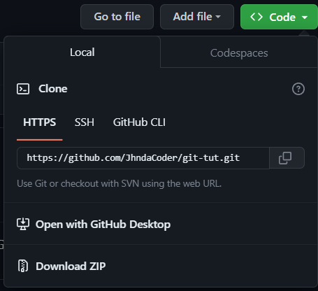

# Make your first Github Contributions here

## 1. Begin your journey by learning about Git and Github. Learn how it works and its various commands

### 1.1 Resources

- [CodeWithHarry](https://www.youtube.com/watch?v=VW7nnPSUJbQ&list=PLu0W_9lII9agwhy658ZPA0MTStKUJTWPi)

- [Notes]()
  
## 2. Start Contributing (Try yourself first!!)

### 2.1 Fork this Repository (simple Repo)

- Fork this repository by clicking on the fork button on the top of this page. This will create a copy of this repository in your account.

### 2.2 Clone this Repo locally

- Go to your GitHub account and to this forked Repo, click on the `Code` button and then click the Copy to Clipboard Icon.
 

- Now open Command Line/Terminal.
- Switch to the Directory where you want to Clone this Repo.
- Run the command
 `git clone "URL you just copied"`

### 2.3 Create a branch

- Change to the repository directory on your computer (if you are not already there):
 `cd git-tut`
- Now create a branch using the `git checkout` command:
  `git checkout -b <branch-name>`

### 2.4 Make necessary changes

- Go to [Task directory]()
- Create a markdown file with your name e.g. `yourname.md`  
- Write about yourself (e.g. your skills, hobbies, interests, etc.) in the markdown file.
- Save the file and close it.

### 2.5 Commit your changes

- `git status`
- `git add <file-name>`
- `git commit -m "Contribution: yourname"`

### 2.6 Push the changes to Github

- `git push origin <branch-name>`

### 2.7 Make a Pull Request (PR)

- Go to your forked Repo in Github and click on `Compare & pull request` button.
- Click `Create pull request` to open a new pull request.
